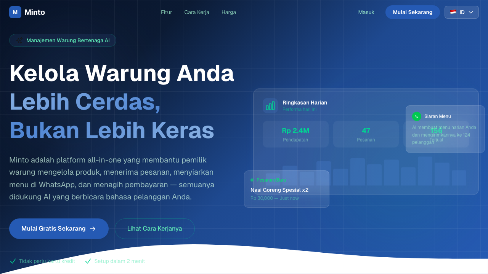
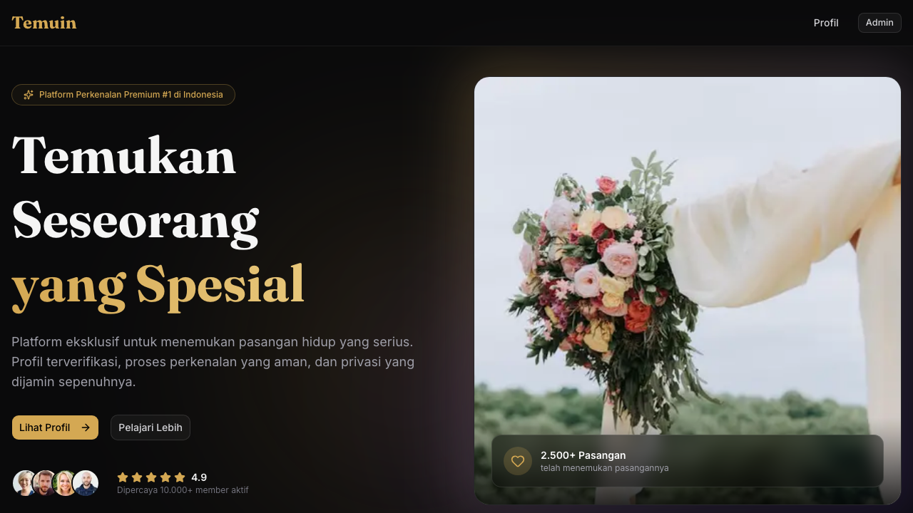

# Dian Andrian Ginting

**Platform Architect | AI Systems Engineer | Technical Leader**

11+ years building scalable platforms across job marketplaces, AI-powered SaaS, and consumer products in Southeast Asia.

---

## Projects

### Minto — AI-Powered Warung Management

> Manage your warung smarter. Products, WhatsApp menus, orders, and payments — all powered by AI that speaks your customers' language.

[](https://d2rkpbcratycn6.cloudfront.net)

**Live** : [d2rkpbcratycn6.cloudfront.net](https://d2rkpbcratycn6.cloudfront.net)

**What it does** : All-in-one platform for Indonesian warung owners — product management, WhatsApp menu broadcasting, order tracking, and payment collection, powered by conversational AI.

**Key Features** :
- AI-powered product & menu management
- WhatsApp broadcast for daily menus
- Order tracking & payment collection
- Built for Indonesian micro-businesses

---

### Temuin — Premium Matchmaking Platform

> Platform Perkenalan Premium #1 di Indonesia. Find someone special with verified profiles, end-to-end encryption, and time-limited introductions.

[](https://d1kz7njmgzofm6.cloudfront.net)

**Live** : [d1kz7njmgzofm6.cloudfront.net](https://d1kz7njmgzofm6.cloudfront.net)

**What it does** : A premium matchmaking platform for serious relationship seekers in Indonesia — verified profiles, bank-level encryption, and exclusive introductions with time-limited access links.

**Key Features** :
- Identity-verified profiles (KTP verification)
- End-to-end encryption & bank-level data security
- Time-limited access links for focused introductions
- 10,000+ active members
- 2,500+ successful matches

---

## Portfolio Site (Minto Pyramid Structure)

This GitHub Pages site presents my engineering portfolio using the **Minto Pyramid Principle** — leading with impact, then supporting with evidence and technical depth:

```
1. The Answer   -->  Hero: "I architect multi-brand job marketplace platforms..."
2. Key Results  -->  10 brands, 86M records, 300+ APIs, AI platform migration
3. Evidence     -->  Architecture, AI/ML systems, tech stack, leadership
4. Details      -->  Career timeline, vision & roadmap
```

**Live** : [dianginting.github.io](https://dianginting.github.io)

### Sections

| # | Section | What's Inside |
|---|---------|---------------|
| 1 | **Hero** | Value proposition + animated stat counters |
| 2 | **Key Results** | 5 impact cards — multi-tenant, AI migration, scale |
| 3 | **Architecture** | Multi-tenant platform, event-driven search, ranking algorithm |
| 4 | **AI Platform** | 8 AI systems table (Gemini, GPT-4o, internal models) |
| 5 | **Tech Stack** | Categorized pill badges across 9 categories |
| 6 | **Leadership** | Stakeholder negotiation, engineering culture |
| 7 | **Career Timeline** | Vertical timeline from 2013 to present |
| 8 | **Vision** | Next 24-month roadmap |

---

## Tech Stack (Across Projects)

```
Languages    : Groovy, Kotlin, Java, Python, PHP, SQL
Frameworks   : Micronaut 3.x/4.x, Spring Cloud Gateway, GORM/Hibernate
AI/NLP       : Gemini 2.0 Flash, GPT-4o Mini, Lingua NLP
Data         : MySQL 8, Elasticsearch, Redis, Caffeine, R2DBC
AWS          : Lambda, Kinesis, SQS FIFO, SNS, S3, CloudFront, RDS
Event        : Debezium 3.0 CDC, SQS FIFO Choreography, JPA Entity Listeners
Infra        : CloudFront, S3 Static Hosting, GitHub Pages
Frontend     : HTML/CSS/JS (zero-dependency), responsive dark theme
```

---

## Connect

- [GitHub](https://github.com/dianginting)
- [LinkedIn](https://www.linkedin.com/in/dian-andrian-ginting-5ba533aa/)
